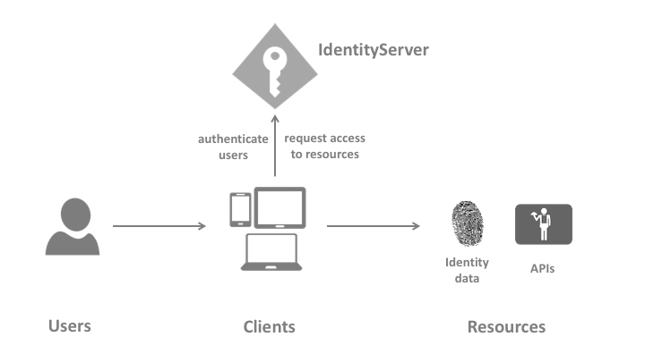

术语
===========

你需要了解一下，规范、文档和对象模型使用的术语有哪些。

IdentityServer
^^^^^^^^^^^^^^
IdentityServer 是一个 OpenID Connect 提供程序 - 它实现了 OpenID Connect 和 OAuth 2.0 协议。

针对同一个角色（IdentityServer）在不同的文献中会有不同的术语 - 比如安全令牌服务（security token service），身份提供者（identity provider），授权服务器（authorization server）， IP-STS 等等。

其实它们都是同一个东西：一种向客户发放安全令牌的软件。

IdentityServer 包含许多工件（jobs）和特性（features）：

* 保护您的资源

* 使用本地帐户存储或通过外部身份提供程序对用户进行身份验证

* 提供会话管理和单点登录

* 管理和认证客户

* 向客户颁发身份（Identity）和访问令牌

* 验证令牌

用户（User）
^^^^
用户是使用注册客户端访问资源的人。

客户端（Client）
^^^^^^
客户端是一个从 IdentityServer 请求令牌的软件 - 用于验证用户（请求身份令牌）或访问资源（请求访问令牌）。 客户端在请求令牌之前必须首先向 IdentityServer 注册。

客户端的例子有 Web 应用程序，原生移动或桌面应用程序，SPA，服务器进程等。

资源（Resources）
^^^^^^^^^
资源是您想要使用 IdentityServer 保护的内容 - 用户的 Identity 数据或 API。

每个资源都有一个唯一的名称 - 客户端使用该名称来指定他们想要访问哪些资源。

**Identity 数据**
关于用户的身份信息（又称 声明（claims）），例如姓名或电子邮件地址。

**APIs**
API 资源表示客户端想要调用的功能 - 通常以 Web API 为模板，但不一定是。

Identity 令牌
^^^^^^^^^^^^^^
identity 令牌的代表身份验证过程的结果。它至少包含用户的标识符(称为 `sub` 主题声明) 和有关用户如何以及何时进行身份验证的信息。 它可以包含额外的身份数据。

访问令牌
^^^^^^^^^^^^
访问令牌允许访问API资源。 客户请求访问令牌并将其转发给API。访问令牌包含有关客户和用户（如果有的话）的信息。API 使用该信息来授权访问其数据。
