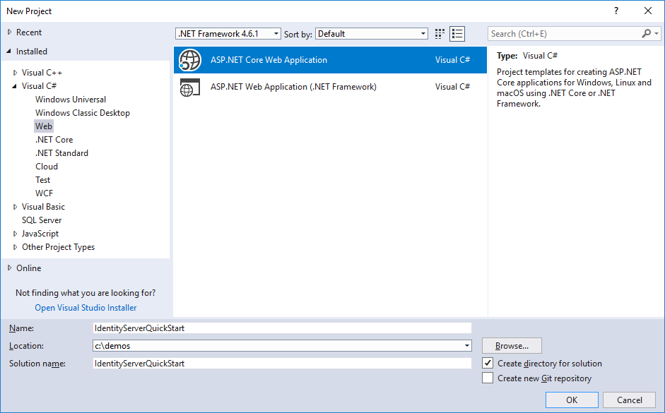
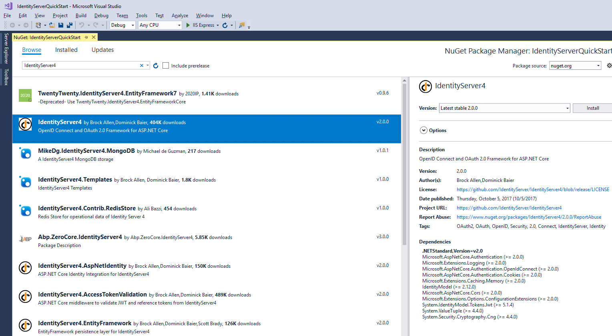
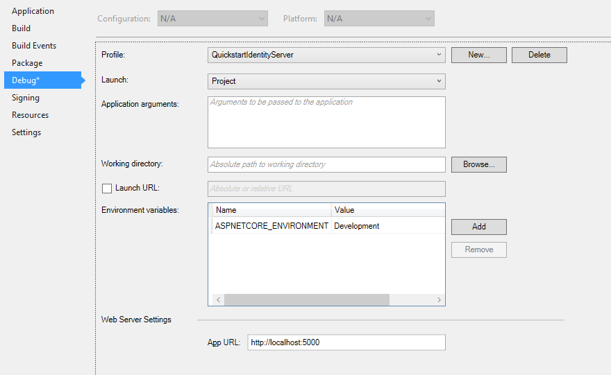
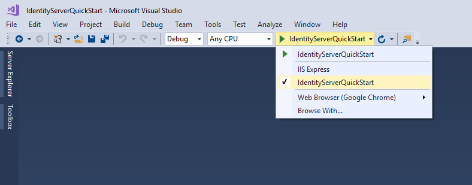

启动和概览
==================

有两种基本的方式来启动一个新的 IdentityServer 项目:

* 从空项目开始（从头开始）
* 从 Visual Studio 的 ASP.NET Identity 模板开始

假如您从头开始，不要担心所有的东西都需要从头弄起，因为我们提供了一些帮助和内存存储方法。

假如您从 ASP.NET Identity 模板开始，我们也提供了一种简单的方法来集成它。

quickstarts 为各种常见的 IdentityServer 使用场景提供了说明，它们绝对是从基础开始，如果要变得更复杂 - 建议您一步一步来。

每个 quickstart 都有一个参考的解决方案 - 您可以在 quickstarts 文件夹的
`IdentityServer4.Samples <https://github.com/IdentityServer/IdentityServer4.Samples>`_
repo 找到参考代码。

从头开始
^^^^^^^^^^^
Visual Studio 的屏幕截图 - 但这不是必需的。

**新建一个快速启动 IdentityServer**

首先创建一个 ASP.NET Core 项目。

然后选择 "Empty" 模板选项。

.. image:: images/0_empty_web.png

下一步，在 nuget 把 `IdentityServer4` 软件包添加到项目:

    
当然你也可以通过控制台程序，运行下面的命令来把依赖添加到项目中:

    "Install-Package IdentityServer4"

.. note:: ASP.NET Core 1.1 添加版本为 1.x 的 IdentityServer，ASP.NET Core 2.0  添加版本为 2.x 的 IdentityServer。

IdentityServer 通常是通过配置来把 services 附加到 ASP.NET Core 主机（host）的。
在 ``ConfigureServices`` 中配置请求服务（required services）且把其注册到 DI 系统。 
在 ``Configure`` 中配置中间件（middleware），使其附加到 HTTP 管道。

修改你的 ``Startup.cs`` 文件，让它和下面一样::

    public class Startup
    {
        public void ConfigureServices(IServiceCollection services)
        {
            services.AddIdentityServer()
                .AddDeveloperSigningCredential();
        }

        public void Configure(IApplicationBuilder app, IHostingEnvironment env)
        {
            if (env.IsDevelopment())
            {
                app.UseDeveloperExceptionPage();
            }

            app.UseIdentityServer();
        }
    }

``AddIdentityServer`` 在 DI 中注册 IdentityServer 服务。 它还为运行时状态注册了一个内存存储。这在开发场景很有用。对于生产场景，您需要持久存储或共享存储，如数据库或缓存。
更多入门信息，请查看 :ref:`EntityFramework <refEntityFrameworkQuickstart>` 。

``AddDeveloperSigningCredential`` 一般用于开发环境创建临时登录令牌。对于生产场景，需要持久化一些重要令牌，这个必须要被换掉。更多信息，请查看:ref:`cryptography docs <refCrypto>` 。

.. Note:: IdentityServer 到这里还不能被启动。接下来我们将添加请求服务。

修改 hosting
^^^^^^^^^^^^^^^

默认情况下，Visual Studio使用IIS Express来托管您的Web项目。这样的话，您除了无法看到实时输出到控制台的日志，其他都很好。 

IdentityServer 全部使用日志记录，而在 UI 或返回给客户端中 "可见" 的错误消息是故意简化的。

我们建议在控制台中运行 IdentityServer。 您可以在 Visual Studio 中切换启动配置文件来完成设置。每次启动的时候不需要启动浏览器-因此您可以关闭此功能：

此外，在快速入门中使用了约定的 URL,这对运行 IdentityServer 非常有帮助。
您可以在上面的 launch profile 对话框中配置这个 URL，并使用 ``http://localhost:5000/``。在上面的屏幕截图中，您可以看到已配置的 URL。

.. Note::我们建议为 IIS Express 和自托管配置相同的端口。 这样，您可以在两者之间任意切换，而不必修改客户端中的任何配置。

要在启动时选择控制台托管，必须在 Visual Studio 的启动菜单中选择它：

如何运行快速入门（quickstart）项目
^^^^^^^^^^^^^^^^^^^^^^^^^^^^^^^^^^^^^
如上所述，每个 quickstart 都有一个参考的解决方案 - 您可以在 quickstarts 文件夹的 
`IdentityServer4.Samples <https://github.com/IdentityServer/IdentityServer4.Samples>`_
repo  找到参考代码。

运行快速启动解决方案的各个部分的最简单方法是将“当前项目”设置为启动项。 右键点击解决方案并选择 "设置启动项目":

.. image:: images/0_startup_mode.png

通常，您首先启动IdentityServer，然后启动API，然后启动客户端。 如果你真的想调试，只能在调试器中运行。
否则，Ctrl + F5是运行项目的最佳方式。
