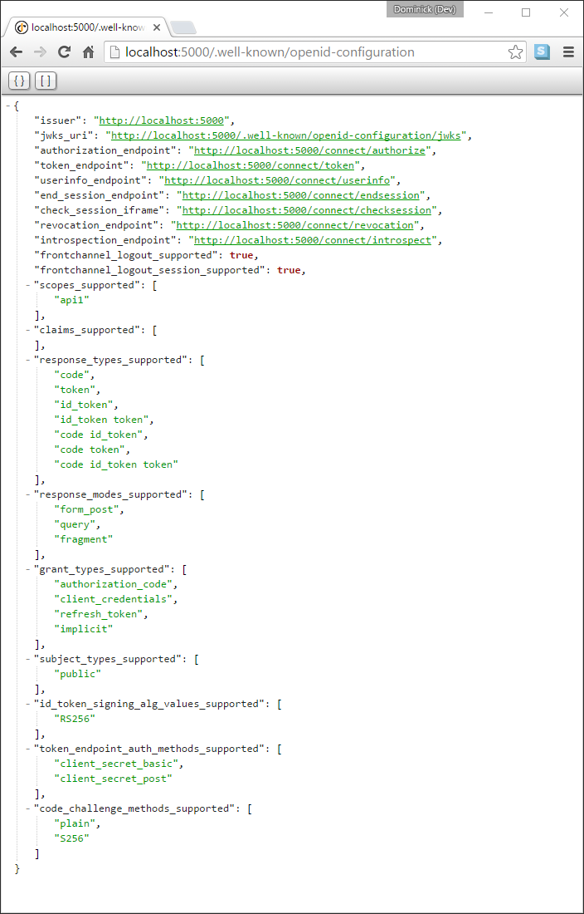
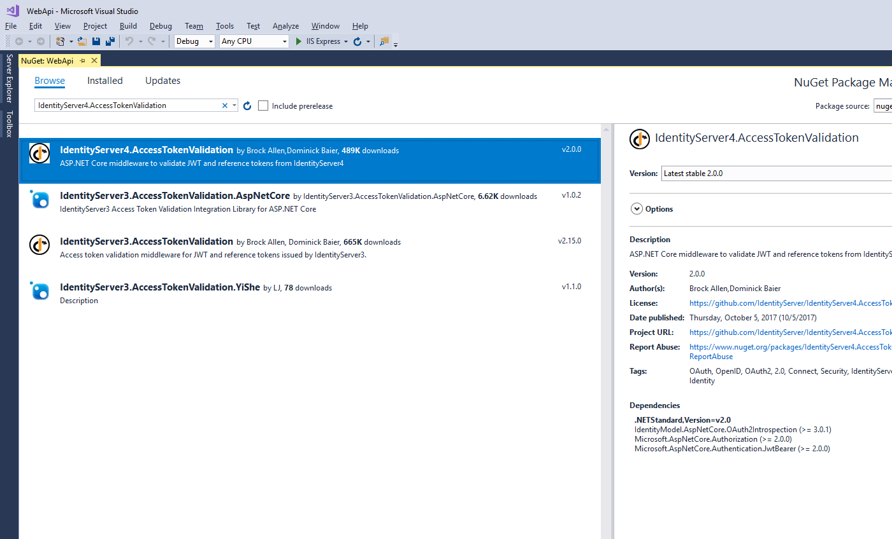
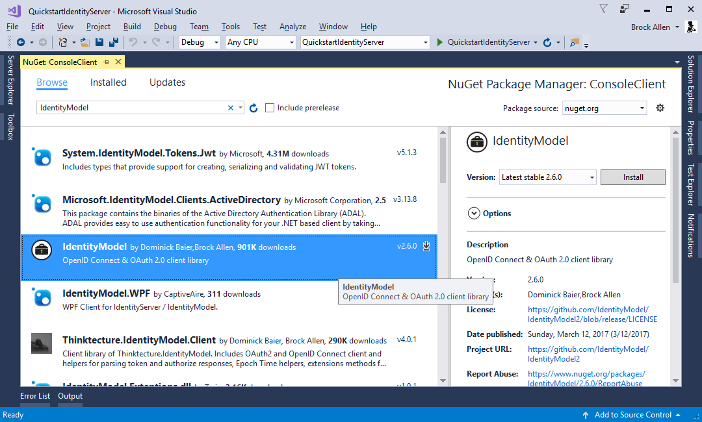

.. _refClientCredentialsQuickstart:
使用客户端凭据保护 API
==========================================

quickstart 介绍了使用 IdentityServer 保护 API 的最基本场景。

接下来的场景，我们将定义一个 API 和一个想要访问它的客户端。 客户端将在 IdentityServer 上请求访问令牌并使用它来访问 API。

定义 API
^^^^^^^^^^^^^^^^
在系统中定义您需要保护的资源的范围，比如 APIs。

由于我们演示的项目使用的是内存存储 - 您需要添加一个 API，它创建了一个类型为 ``ApiResource`` 的对象并设置了一些属性。

在您的项目中添加一个文件 (比如 ``Config.cs``) ，然后把下面的代码放进去::

    public static IEnumerable<ApiResource> GetApiResources()
    {
        return new List<ApiResource>
        {
            new ApiResource("api1", "My API")
        };
    }

定义客户端（client）
^^^^^^^^^^^^^^^^^^^
接下来就是定义一个用于访问这个 API 的客户端。

当前场景下，客户端是不需要用户操作的，并且 IdentityServer 校验客户端密钥。
将下面的代码添加到 `Config.cs` 文件中::

    public static IEnumerable<Client> GetClients()
    {
        return new List<Client>
        {
            new Client
            {
                ClientId = "client",

                // no interactive user, use the clientid/secret for authentication
                AllowedGrantTypes = GrantTypes.ClientCredentials,

                // secret for authentication
                ClientSecrets =
                {
                    new Secret("secret".Sha256())
                },

                // scopes that client has access to
                AllowedScopes = { "api1" }
            }
        };
    }

配置 IdentityServer
^^^^^^^^^^^^^^^^^^^^^^^^
配置 IdentityServer 使您定义的范围（scopes）和客户端（client）生效，您需要把一下代码添加到 ``ConfigureServices`` 方法中。
您可以像下面一样，使用一些扩展方法，就能很方便的将相应的存储方式和数据注册到 DI 系统中 ::

    public void ConfigureServices(IServiceCollection services)
    {
        // configure identity server with in-memory stores, keys, clients and resources
        services.AddIdentityServer()
            .AddDeveloperSigningCredential()
            .AddInMemoryApiResources(Config.GetApiResources())
            .AddInMemoryClients(Config.GetClients());
    }

就是这样 - 当您运行服务器并在浏览器中输入
``http://localhost:5000/.well-known/openid-configuration``，您可以看到所谓（so-called）的发现文档。
您的客户端和 API 将用它来下载一些必要的配置数据。

添加 API
^^^^^^^^^^^^^
下面，添加一个 API 到你的解决方案。

您可以使用 ASP.NET Core Web API 模板。
同样，我们建议您使用与之前相同的方法来配置 Kestrel 和启动配置文件。
本演示项目假定您已将您的 API 配置为 ``http://localhost:5001``。

**controller**

在 API 中新建一个新的 controller::

    [Route("identity")]
    [Authorize]
    public class IdentityController : ControllerBase
    {
        [HttpGet]
        public IActionResult Get()
        {
            return new JsonResult(from c in User.Claims select new { c.Type, c.Value });
        }
    }

该 controller 将用于请求授权测试，并通过 API 视角来显示声明标识（claims identity）。

**配置**

最后一步是将认证服务添加到 DI 并把认证中间件（middleware）添加到管道中（pipeline）。这将会：

* 验证传入的令牌以确保它来自受信任的颁发者
* 验证该令牌是否可以访问该 API（又名作用域）

添加 `IdentityServer4.AccessTokenValidation` NuGet 包到你的项目中。

像下面这样更新你的 `Startup` ::

    public class Startup
    {
        public void ConfigureServices(IServiceCollection services)
        {
            services.AddMvcCore()
                .AddAuthorization()
                .AddJsonFormatters();

            services.AddAuthentication("Bearer")
                .AddIdentityServerAuthentication(options =>
                {
                    options.Authority = "http://localhost:5000";
                    options.RequireHttpsMetadata = false;

                    options.ApiName = "api1";
                });
        }

        public void Configure(IApplicationBuilder app)
        {
            app.UseAuthentication();

            app.UseMvc();
        }
    }

``AddAuthentication`` 将认证服务注册到 DI 并把 ``"Bearer"`` 配置为默认方案。
``AddIdentityServerAuthentication`` 将 IdentityServer 访问令牌验证处理程序注册到 DI 以供认证服务使用。
``UseAuthentication`` 把认证中间件（middleware）添加到管道，因此每次访问主机（host）都会自动执行认证。

如果您使用浏览器导航到 Identity 控制器 (``http://localhost:5001/identity``)，返回的则应该是 401 状态码。这意味着您需要一个凭据才能访问这个 API 。

像这样，这个 API 就受到了 IdentityServer 的保护。

创建客户端（client）
^^^^^^^^^^^^^^^^^^^
最后一步，就是写一个客户端，用来请求访问令牌人，然后使用这个令牌去访问 API。因此，在您的解决方案中添加一个控制台程序 (完整代码请查看  `这里 <https://github.com/IdentityServer/IdentityServer4.Samples/blob/release/Quickstarts/1_ClientCredentials/src/Client/Program.cs>`_)。

IdentityServer 中的令牌节点实现了 OAuth 2.0 协议，您可以使用原始的 HTTP 来访问它。但是，我们有一个名为 IdentityModel 的客户端使用库，它将协议交互封装在易于使用的 API 中。

在您的项目中添加 `IdentityModel` NuGet 包。

IdentityModel 包含一个发现节点（discovery endpoint）的客户端使用库。
这样您只需要知道 IdentityServer 的基地址（base-address） - 实际节点地址可以从元数据中获取 ::

    // discover endpoints from metadata
    var disco = await DiscoveryClient.GetAsync("http://localhost:5000");
    if (disco.IsError)
    {
        Console.WriteLine(disco.Error);
        return;
    }

接下来，您可以使用 ``TokenClient`` 类来请求令牌。创建实例您只需要传递一个令牌节点地址，客户端 ID 和 密钥。

然后您可以使用 ``RequestClientCredentialsAsync`` 方法为您的 API 请求一个令牌 ::

    // request token
    var tokenClient = new TokenClient(disco.TokenEndpoint, "client", "secret");
    var tokenResponse = await tokenClient.RequestClientCredentialsAsync("api1");

    if (tokenResponse.IsError)
    {
        Console.WriteLine(tokenResponse.Error);
        return;
    }

    Console.WriteLine(tokenResponse.Json);

.. note:: 将访问令牌从控制台复制和粘贴到 `jwt.io <https://jwt.io>`_ 以检查原始令牌。

最后一步就是调用 API。

将访问令牌发送到 API，您通常使用 HTTP 授权标头。
在这里使用 ``SetBearerToken`` 扩展方法来完成 ::

    // call api
    var client = new HttpClient();
    client.SetBearerToken(tokenResponse.AccessToken);

    var response = await client.GetAsync("http://localhost:5001/identity");
    if (!response.IsSuccessStatusCode)
    {
        Console.WriteLine(response.StatusCode);
    }
    else
    {
        var content = await response.Content.ReadAsStringAsync();
        Console.WriteLine(JArray.Parse(content));
    }

输出看起来应该像这样:

.. image:: images/1_client_screenshot.png

.. note:: 默认情况下，访问令牌的声明将包含访问边界（scope），生命周期（lifetime (nbf and exp)），客户端 ID (client_id) 和发行者名称（issuer name (iss)）。

进一步实验
^^^^^^^^^^^^^^^^^^^

到目前为止，该演示项目主要聚焦于

* 客户端可以成功的请求令牌
* 客户端能使用令牌访问 API

您现在可以尝试引发错误以便了解系统的运行方式，例如

* 在 IdentityServer 没有运行的情况下，尝试连接它 (不可用)
* 尝试使用无效的客户端ID或密钥来请求令牌
* 尝试使用有效令牌访问该令牌可访问边界外的资源
* 尝试在 API 没有运行的情况下，调用它 (不可用)
* 不发送令牌到 API
* 将 API 配置到令牌可访问边界外的资源范围中去
